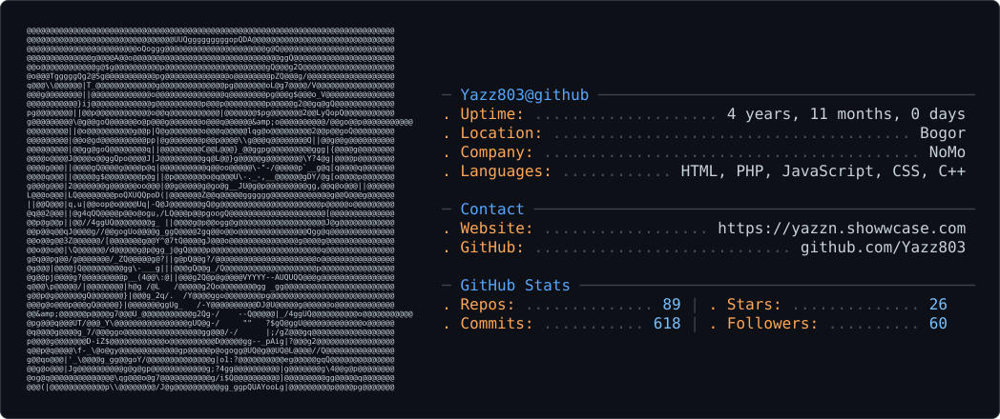

<picture>
  <source media="(prefers-color-scheme: dark)" srcset="dark_mode_2.svg" />
  <source media="(prefers-color-scheme: light)" srcset="light_mode_2.svg" />
  
</picture>

<!-- <picture decoding="async" loading="lazy">
  <source media="(prefers-color-scheme: light)" srcset="https://pixel-profile.vercel.app/api/github-stats?username=Yazz803&theme=summer&pixelate_avatar=false">
  <source media="(prefers-color-scheme: dark)" srcset="https://pixel-profile.vercel.app/api/github-stats?username=Yazz803&theme=summer&pixelate_avatar=false">
  
</picture> -->

<h1 align="center">Hi , I'm Yazid</h1>

  

